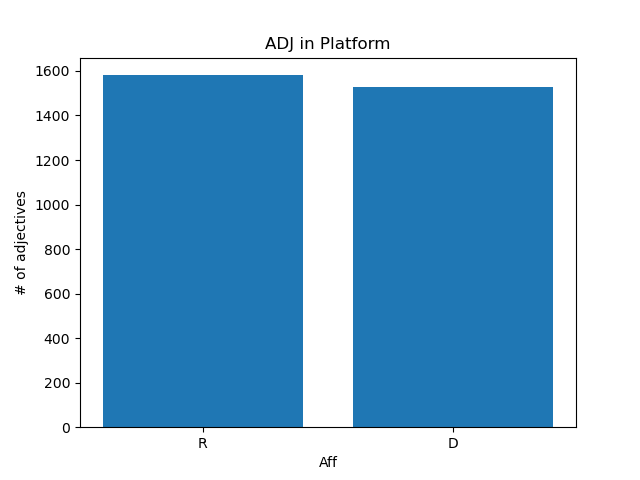

# Final Report

Emma Tarcson \| egt12@pitt.edu

## Table of Contents:
* [Background](#Background)
* [Data Collection](#Data-Collection)
  * [Background for data](#Background-for-data)
  * [Collecting data](#Collecting-data)
  * [Issues with Licensing](#Issues-with-Licensing)
  * [Cleaning the data](#Cleaning-the-data)
* [Analysis](#Analysis)
  * [Speech Analysis](#Speech-Analysis)
  * [Debate Analysis](#Debate-Analysis)
  * [Platform Analysis](#Platform-Analysis)
  * [Extra Analysis](#Extra-Analysis)
* [Results](#Results)
  * [Results of First Hypothesis](#Results-of-the-First-Hypothesis)
  * [Results of Second Hypothesis](#Results-of-the-Second-Hypothesis)
* [Conclusion](#Conclusion)

## Background
Initially, while trying to come up with an idea for this project, I did not know much about the world of data science. I did have a little bit of linguistics knowledge, though, so I decided to choose a topic that I had learned about the previous semester: Rhetorical Analysis.

I had this idea that I would use all of python's wonderful language analysis tools (love you, nltk) to determine the "effectiveness" of the kinds of persuasive language features in text. This kind of left me with no where to start, though, as I, thanks to Na Rae and Joey, could not figure out how the heck I would prove "effectiveness". The project was also pretty two-dimensional, as well: only focusing on the frequency of persuasive devices.

So, on the final night that I was able to switch project ideas, I tweaked the concept a bit.

I was already using RNC and DNC speeches as the data as it would be polarizing and I thought that the conventions would be great sources for analysis persuasion, but then I also started thinking about how those conventions would be super polarizing and I wanted to take that further. So, I focused on politics, instead of just focusing on the vague "persuasive" text thing I had going before. This allowed me to play with future analysis ideas, as well as, play with an idea that I was already curious about: if Democratic and Republican text/speech is actually all that different or do they use similar ways of getting people to their side (rhetoric). This also allowed me to go even further and start thinking about if the mode or place of persuasion (speech, debate, platform) had any effect on that.

## Data Collection
#### Background for data
2020 was a big year for politics. There was the presidential election, after all. This fact gave me a good bit of recent text I'd be able to use that all occurred within the past couple months of the year.

#### Collecting data
First are the RNC and DNC speeches. I got these off of a pretty Kaggle folder that had all speech transcripts in clean text files. The links to these can be found [here](https://github.com/Data-Science-for-Linguists-2021/PoliticalRhetoric-analysis/blob/main/data_sample/data_link.md), and the [README](https://github.com/Data-Science-for-Linguists-2021/PoliticalRhetoric-analysis/blob/main/README.md) markdown file.

Second is the debate transcripts. Links to the website URLs can be found on the [README](https://github.com/Data-Science-for-Linguists-2021/PoliticalRhetoric-analysis/blob/main/README.md) markdown file. I scraped these using scrapy, and cleaned them up a bit during that process with regex and xpath. I won't lie, this was a bit strenuous, but satisfying nonetheless. After scraping, I converted both transcripts into csv files, which can be found [here](https://github.com/Data-Science-for-Linguists-2021/PoliticalRhetoric-analysis/tree/main/data), which just the text, speaker, and time stamps.

Third is the platforms. Links to the website URLs can be found on the [README](https://github.com/Data-Science-for-Linguists-2021/PoliticalRhetoric-analysis/blob/main/README.md) markdown file. These were easily downloadable, though I suppose I could have scraped them as well and received even better results as I did have to work with the platform data a little bit in jupyter notebook.

#### Issues with Licensing
Luckily, the data I was using was mainly in the public domain, being political text and whatnot. That being said, there were some cases where I wasn't fully able to present the data. Because the RNC and DNC speeches were from someone else, I decided to provide a link and a sample set of the data rather than pushing it all onto github. With the debates, I was worried that I wouldn't be able to use it either, but after receiving feedback from Na Rae and discussing it with reputable sources at Pitt's library, I decided to present the scraped csv files in the [data](https://github.com/Data-Science-for-Linguists-2021/PoliticalRhetoric-analysis/tree/main/data) folder. For the platforms, once again, I was able to use them freely, but after checking the website and other information online, I found that it'd be best to keep these in a git ignored folder rather than showing them on this repository.

Licensing of my own project came after that. I decided to use [GNU General Public License v3.0](https://choosealicense.com/licenses/gpl-3.0/) because it included freedom to use my project, but requires disclosing the source so that others can find and use my work. I found this important as I added information to the original data collection (political affiliation).

#### Cleaning the data
Cleaning the data took place in [this](https://github.com/Data-Science-for-Linguists-2021/PoliticalRhetoric-analysis/blob/main/dataplan.ipynb) jupyter notebook. (At the time of completing this project, nbviewer had an unhealthy backend error)

First, I took care of the RNC and DNC speeches and made a dataframe with both conventions. This included the .txt file names and transcripts, and I added political affiliations. Some people noted that there was a couple instances where some speakers couldn't be techincally considered a Republican or Democrat, but since I was more focusing on the speeches as representations of the convention that they were from, I kept them as the affiliation from the convention they attended (though I could have used this information in the analysis portion where I needed more neutral stances: see [Speech Analysis](#Speech-Analysis)). I also ended up getting rid of the .txt filenames, as well, because the affiliation was what was important not the actual person speaking. Then, I saved this dataframe to conv_speeches.csv.

Second, I worked with the debates. I striped the last few html leftovers that I couldn't fully remove during the scraping process. I then added affiliations according to the speaker, with "None" for the moderator. I was going to actually completely get rid of the moderator here, but keeping them in ended up coming in handy: see [Debate Analysis](#Debate-Analysis). I saved the affiliation column and transcript column of the two debates with both Speaker and No-Speaker rows to csv files.

Third, I imported the platforms and made a dataframe, which ended up just being two rows with ALL the text, and that made me laugh when it happened because I was for some reason not expecting it to do that, but I quickly realized I should tokenize the platforms by sentences. I probably could have done paragraphs, which makes me wonder if the results would be different, but since I mainly just used words as features for this analysis, I figured that it didn't matter. But, so I added the affiliations just like the two others and voila.

During this entire notebook, you'll noticed that I am adding full texts of the platforms, debates, and speeches to this thing called main.csv. This was entirely so that I'd have all the text in one place.

## Analysis
For the analysis portion of this project, I focused on the differences/similarities between Republican and Democrat texts and the manner of which that they come from.

I came up with, what I believed, are the main functions of the convention speeches, debates, and platforms. A big factor in rhetoric is audience, so I thought about that in terms of the three "modes" of persuasion.

Here are the attribute I assigned with each before starting the analysis:

> Convention Speeches
* intent: to further stance directed at only one affiliation group
* audience: otherwise already persuaded

> Debates
* intent: more spontaneous, fast-paced persuasion to all voters
* audience: maybe have an idea of who they will vote for, and both affiliations are present

> Platforms
* intent: inform those who may not know much about each party about stances and views
* audience: everyone

After coming up with these, I formulated three hypotheses.

First: I predicted that a classifier would be able to classify R or D most accurately with the speeches, then the debates, then the platforms. This was because I figured that the speeches would have the most polarizing words used, then the debates where the candidates might use "hot topic" words to persuade voters to their side, then the platform, which was considerably the most informative of documents

Second: I wanted to take a peak into the adjectives used and see how that would influence a classifier with each "mode" of persuasion. Basically, that hypothesis included the theory that Republicans would use more adjectives, or more "heavy" adjectives. Also, that debates would have the most adjectives used, then the speeches, then the platform.

#### Speech Analysis
The speech analysis notebook can be found [here on github](https://github.com/Data-Science-for-Linguists-2021/PoliticalRhetoric-analysis/blob/main/analysis_notebooks/speech_analysis.ipynb) as well as hopefully nbviewer when the \#503 error lets up.

For the speech analysis, I wanted to use bag-of-words with svc for the classification between R and D speeches. The accuracy came out to about what I expected as being quite high: 95%. In fact, there was only one case of the classifier predicting the wrong affiliation.

I also tried out logistic regression using TTR, token count, type count, amount of sentences, and the average sentence length. The idea for this is that maybe there was some information in the organizational aspects, which is an aspect of rhetorical analysis, of the speeches between RNC and DNC speeches. Like for example, maybe Republicans used shorter sentences for emphasis, or maybe the Democrats generally used a more diverse vocabulary. But the regression model's accuracy ended up as only 45%, so while I could have played around with this more, it kind of showed to me that there was no big organizational difference between political speeches. Politicians do speeches as politicians do.

After this, I tried removing certain words from the speeches. I thought that maybe the reason the classifier was so accurate was because the speakers maybe used phrases like "Hello. Welcome to the **Democratic** Convention" or "Thank you for tuning into the **Republican** National Convention", and those words were super influential to the classifier. It ended up increasing the accuracy, but I actually found that later in the [Fifth Section](https://render.githubusercontent.com/view/ipynb?color_mode=auto&commit=db85e96c2763caaadcaa95bd6da20a849da036d3&enc_url=68747470733a2f2f7261772e67697468756275736572636f6e74656e742e636f6d2f446174612d536369656e63652d666f722d4c696e6775697374732d323032312f506f6c69746963616c526865746f7269632d616e616c797369732f646238356539366332373633636161616463616139356264366461323061383439646130333664332f616e616c797369735f6e6f7465626f6f6b732f7370656563685f616e616c797369732e6970796e62&nwo=Data-Science-for-Linguists-2021%2FPoliticalRhetoric-analysis&path=analysis_notebooks%2Fspeech_analysis.ipynb&repository_id=339988672&repository_type=Repository#Fifth-Section) of the notebook, that it wasn't the DNC speeches that mainly used the words "Democratic" or "Democrats", it was actually the RNC speakers.

More in that section: So here's where things get... weird.
I really wanted to find informative features, I really wouldn't be able to do much of this project without it. Because there were only two targets for the classifier, for some reason, the coefficients ended up merging together as one array. I found a code online, that was based off of the print_top function but for cases like mine that I only had two target, and I tried it, but as I note in the notebook, it seemed *not right*. So, in my desperation, I ended up adding an extra row in the conv_speeches dataframe that had a neutral affiliation, with only a "." as the text. This ended up giving me the most informative features for both R and D, though because of this, I wonder if they became more polarizing due to the added neutrality. I figured, though, since the accuracy was so high, that there had to be some truth to the fact that the informative features were so different and dividing, and it ended up making sense with my hypothesis, so I let it be. Thinking about it now, I could have changed the affiliation of the speakers that were considerably more *moderate* in their stances, so I wonder how that would have changed things.
#### Debate Analysis
The debate analysis notebook can be found [here on github](https://github.com/Data-Science-for-Linguists-2021/PoliticalRhetoric-analysis/blob/main/analysis_notebooks/debate_analysis.ipynb) as well as hopefully nbviewer when the \#503 error lets up.

So for the debates, I imported the ONLY D AND R vp debate csv and pres debate csv, the ALL SPEAKERS vp debate csv and pres debate csv, and then concatenated both csvs into all debates and all FULL debates.

So, I also tried logistic regression here with the thought that sentences length and other \~meta\~ data would be informative. Basically, I wanted to know if there was something to be said for candidates who interrupted more or used longer sentences. (Organizational). This was a flop and, like the speech analysis, didn't actually mean much. I started with the pres debate (ONLY D AND R), but after seeing the result, I'll be honest, I figured that that would be the general result for the rest.

Then, I tried multiple classifiers with each debate csv. The presdebate (ONLY D AND R) was not very telling, then more with evened out rows. The vpdebate (ONLY D AND R) had a higher accuracy, then it went down a little when I used both (ONLY D AND R) debates together: reaching around 76%.

I wanted to find informational features once again, and luckily this time I didn't have to add any false neutral rows, as I had the ALL SPEAKERS csvs. I used these for this portion of the analysis and found informational features for the presidential debate and vice presidential debate. Then I found bigrams for them as well because of the results I was getting (I'll talk about this more in [results](#Results)). I also found the most informative for all the debates.

After I was realizing that this entire notebook was basically conflicting with my first hypothesis, I tried gridsearch to see if I can find better parameters, but that ended up being actually lower.
#### Platform Analysis
The platform analysis notebook can be found [here on github](https://github.com/Data-Science-for-Linguists-2021/PoliticalRhetoric-analysis/blob/main/analysis_notebooks/platform_analysis.ipynb) as well as hopefully nbviewer when the \#503 error lets up.

The platform analysis consisted of the same steps as above. This was the third analysis I started, so I already knew where I was going with it.

The biggest thing was that I stripped certain words, like I tried with the speech analysis, but this time I knew it was needed. I've read both platforms, so I knew this was something I needed to do, lest the analysis would throw off my hypothesis completely.

I started with a grid search here, but instead of just straight up using the parameters, I used the best parameters as a starting point. From there, I was able to get the accuracy up to 82% with an svc classifier. This was actually higher than I expected, as I thought that platform would be the lowest after every analysis. (Words and adjectives).

I used the same process that I used with the speeches for finding the most informative features. I made the neutral text "yo" this time, and if you look at the results of the print_top function, you'll see that the "none" features are in alphabetical order, which told me that maybe this was okay for some desperate feature exraction.
#### Extra Analysis
The extra analysis notebook can be found [here on github](https://github.com/Data-Science-for-Linguists-2021/PoliticalRhetoric-analysis/blob/main/analysis_notebooks/extra_analysis.ipynb) as well as hopefully nbviewer when the \#503 error lets up.

My extra analysis dealt with my second hypothesis. I found adjectives in the speeches, debates, and platform and compared D and R with the amounts. I also compared the "modes" of persuasion with the \# of adjectives, but because the texts were all unevenly distributed against each other, I also foud the average \# of the adjectives and compared that. As an extra extra analysis, I also found the most frequently used adjectives, and the most informative adjective, and also the use of the comparative and superlative adjectives between Donald Trump and Joe Biden. ([Trump's Superlative Addition is Funny, Absurd, and Possibly Dangerous](https://www.esquire.com/news-politics/a15335203/trump-superlatives/)).
## Results
Finally some plots!

#### Results of the First Hypothesis

Speech Analysis Confusion Matrix:

Accuracy Score: 95.2%

Debate Analysis Confusion Matrix:

Accuracy Score: 77.6%

Platform Analysis Confusion Matrix:

Accuracy Score: 80.7%

As you can see, the ranking of accuracy by classifier is Speech -> Platform ->  Debate. This goes against my hypothesis I expected debate to be second and platform to be last. I had expected the speeches to have the most polarizing words, then possibly the debates as they were still persuasive in nature, then the platforms which includes more informative text. But this result showed that platforms were actually more dividing and the words were more informative between parties than debates.

A couple new theories came to mind. Perhaps I had the attributes of platforms and debates switched. Perhaps the platforms were actually more polarizing with the topics they discussed with the intention to pull people in by similar interests, while the debates were more neutral, possibly because of the moderator and that they had to perform for an audience that had to be looked at as neutral, so they matched that. Or maybe since they both had to discuss the same topics, this caused the informative words to not have a lot of weight toward either side.

Here are the informative features I found in each analysis:

As you can see, the speeches and platforms have almost categorical words the whole way down the line. Personally, I could look at those and guess which is which. There is definitely some sort of rhetorical subjecting being presented by both, which makes the accuracy scores make a lot of sense.

I was not impressed by the debates, though, but it also showed that maybe those "hot topic" words were just nto as used in the debates (as they did have to think pretty quick and spontaneous). So, I also decided to take a look at debate bigrams as I wanted to know if that could tell me more about the topics each side was discussing.

Seen above: This definitely tells me a bit more about the topics being emphasized by each side. If you're wondering if this made the accuracy go up, though, spoiler-alert: it didn't. I really am curious why this looks so much more telling, however...

#### Results of the Second Hypothesis

For the second hypothesis I was interested in adjectives and how they were used not only between R and D, but also how they were used when comparing between the different "modes" of persuasion.

Here are the results of that analysis:

These use the counts of adjectives, and shows that Republicans do, in fact, generally use more adjectives. this supports my hypothesis, and made me wonder what kind of adjectives were we talking. So, I found the most frequently used adjectives between both parties, shown in the graph below.

This threw me off a bit because the adjectives here were kind of basic and not really all that interesting, and I started wondering if maybe Republicans just used "American" more often or something like that, so I took a peak at the adjectives being used in the debate speeches:

When I ran the adjectives through print_top, I found the most informative adjectives, which actually surprised me. Sure, the most frequently used adjectives were pretty neutral, but when looking at what kind of adjs Republicans and Democrats were using, I can definitely tell the Republicans were using more \~fancy\~ words than the Democrats, who while they used adjectives, were using less and were using more neutral ones.

After this, since the other analysis I was working with involved comparing the three "modes", I compared them all in bar graphs below.

After realizing that count wouldn't work for this, I used the average:

The debates were using more, than the platforms, then the speeches. My hypothesis was correct for the debates being the first, but once again platforms surprised me. I think this could definitley be the result of the frequently used adjectives list above, where the platforms are just using more words like "American", "public", etc.

Further analysis involved looking at the use of Comparative and Superlative adjectives between Donald Trump and Joe Biden, and the results were not surprising but definitely interesting to see so outwardly obvious.

## Conclusion
In conclusion, this project was a lot of fun and I was able to explore a topic that I'm really interested in. As with most things, I definitely wish I could go back and play with a lot of different things, but I honestly feel like this isn't the end for me with this project (even though technically it is). I was honestly really excited about my results, and I've embarrassingly told a lot of people (who are probably not as interested in politics as me) about what I found out, which is exciting within its self. So I can see myself using this information and the python knowledge I've accumulated this entire trip in the future.

I'm pretty sad that by the time of me turning this in, the nbviewer page will probably not have worked yet, meaning that I wasn't able to convert the jupyter notebooks into a format that would allow people to view the table of contents, but alas \:(

But let's not end on a sad note! Thank you so much Na Rae, Joey, and the whole of the Data Science for Linguists 2021 class for your help and useful feedback throughout this entire semester!
